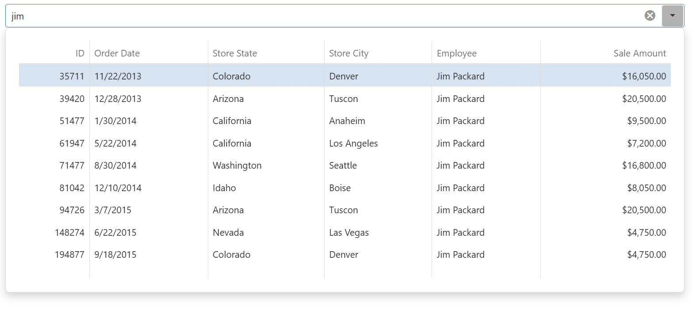

<!-- default badges list -->

<!-- default badges end -->

# DevExtreme DropDownBox - Search in an Embedded DataGrid

This example implements a search that filters data in a [DataGrid](https://js.devexpress.com/Documentation/Guide/UI_Components/DataGrid/Getting_Started_with_DataGrid/) embedded in a [DropDownBox](https://js.devexpress.com/Documentation/Guide/UI_Components/DropDownBox/Getting_Started_with_DropDownBox/) component.

## Implementation Details

The example uses three [DropDownBox](https://js.devexpress.com/Documentation/ApiReference/UI_Components/dxDropDownBox/) event handlers to coordinate search behavior between the input field and the embedded DataGrid.

The [onInput](https://js.devexpress.com/jQuery/Documentation/ApiReference/UI_Components/dxDropDownBox/Configuration/#onInput) handler fires when the user types in the DropDownBox. It opens the dropdown if it is not already open, and filters the DataGrid by updating `dataSource.searchValue()` with the typed text.

The [onOpened](https://js.devexpress.com/jQuery/Documentation/ApiReference/UI_Components/dxDropDownBox/Configuration/#onOpened) handler fires when the dropdown opens. It registers a one-time listener on the DataGrid to move focus to it once the grid is ready for keyboard navigation.

The [onClosed](https://js.devexpress.com/jQuery/Documentation/ApiReference/UI_Components/dxDropDownBox/Configuration/#onClosed) handler fires when the dropdown closes. It resets the search state: if the typed text does not match a valid selection, the handler either selects the first available row or clears the DropDownBox value.

## Files to Review

- **Angular**
    - [app.component.html](Angular/src/app/app.component.html)
    - [app.component.ts](Angular/src/app/app.component.ts)
- **jQuery**
    - [index.html](jQuery/src/index.html)
    - [index.js](jQuery/src/index.js)
- **React**
    - [App.tsx](React/src/App.tsx)
- **Vue**
    - [App.vue](Vue/src/components/DropDownBoxWithDataGrid.vue)
- **ASP.NET Core**    
    - [Index.cshtml](ASP.NET%20Core/Views/Home/Index.cshtml)

## Documentation

- [Getting Started with DropDownBox](https://js.devexpress.com/Documentation/Guide/UI_Components/DropDownBox/Getting_Started_with_DropDownBox/)
- [DropDownBox - Synchronize with the Embedded Element](https://js.devexpress.com/Documentation/Guide/UI_Components/DropDownBox/Synchronize_with_the_Embedded_Element/)
- [DropDownBox API - onInput](https://js.devexpress.com/jQuery/Documentation/ApiReference/UI_Components/dxDropDownBox/Configuration/#onInput)
- [DropDownBox API - onOpened](https://js.devexpress.com/jQuery/Documentation/ApiReference/UI_Components/dxDropDownBox/Configuration/#onOpened)
- [DropDownBox API - onClosed](https://js.devexpress.com/jQuery/Documentation/ApiReference/UI_Components/dxDropDownBox/Configuration/#onClosed)

<!-- feedback -->
## Does This Example Address Your Development Requirements/Objectives?

 

(you will be redirected to DevExpress.com to submit your response)
<!-- feedback end -->
