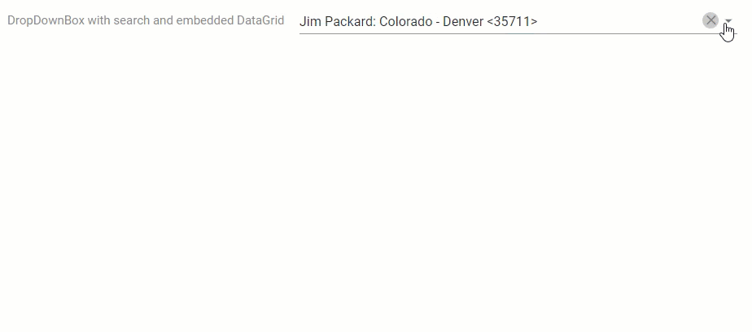

<!-- default badges list -->

<!-- default badges end -->

# DropDownBox for DevExtreme - How to filter data of a nested DataGrid

This example demonstrates how to filter the data of a DropDownBox embedded in a DataGrid component.

Use [onInput](https://js.devexpress.com/jQuery/Documentation/ApiReference/UI_Components/dxDropDownBox/Configuration/#onInput), [onOpened](https://js.devexpress.com/jQuery/Documentation/ApiReference/UI_Components/dxDropDownBox/Configuration/#onOpened) and [onClosed](https://js.devexpress.com/jQuery/Documentation/ApiReference/UI_Components/dxDropDownBox/Configuration/#onClosed) event handlers to filter and display data.

## Files to Review

- **Angular**
    - [app.component.html](Angular/src/app/app.component.html)
    - [app.component.ts](Angular/src/app/app.component.ts)
- **jQuery**
    - [index.html](jQuery/src/index.html)
    - [index.js](jQuery/src/index.js)
- **React**
    - [App.tsx](React/src/App.tsx)
- **Vue**
    - [App.vue](Vue/src/components/DropDownBoxWithDataGrid.vue)
- **ASP.NET Core**    
    - [Index.cshtml](ASP.NET%20Core/Views/Home/Index.cshtml)

## Documentation

- [Getting Started with DropDownBox](https://js.devexpress.com/Documentation/Guide/UI_Components/DropDownBox/Getting_Started_with_DropDownBox/)

- [DropDownBox - Synchronize with the Embedded Element](https://js.devexpress.com/Documentation/Guide/UI_Components/DropDownBox/Synchronize_with_the_Embedded_Element/)

## More Examples

- [DropDownBox - Single Selection](https://js.devexpress.com/Demos/WidgetsGallery/Demo/DropDownBox/SingleSelection)
<!-- feedback -->
## Does This Example Address Your Development Requirements/Objectives?

 

(you will be redirected to DevExpress.com to submit your response)
<!-- feedback end -->
