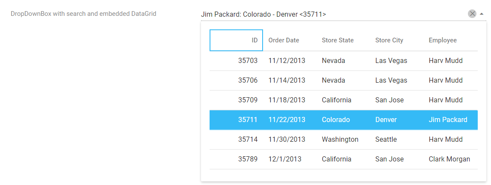

<!-- default badges list -->

<!-- default badges end -->
# DevExtreme DropDownBox - How to filter data of a nested widget when a user types text into the editor

In this example, dxDropDownBox enables end-users to filter list items dynamically based on the text typed into the editor's input box on the client side.

## Files to Review

- **Angular**
    - [app.component.html](Angular/src/app/app.component.html)
    - [app.component.ts](Angular/src/app/app.component.ts)
- **jQuery**
    - [index.js](jQuery/src/index.js)
- **React**
    - [App.js](React/src/App.js)
- **Vue**
    - [App.vue](Vue/src/App.vue)
- **ASP.Net Core**    
    - [Index.cshtml](ASP.NET%20Core/ASP.NET%20Core/Views/Home/Index.cshtml)

## Documentation

- [Getting Started with DropDownBox](https://js.devexpress.com/Documentation/Guide/UI_Components/DropDownBox/Getting_Started_with_DropDownBox/)

- [DropDownBox - API Reference](https://js.devexpress.com/Documentation/ApiReference/UI_Components/dxDropDownBox/)

